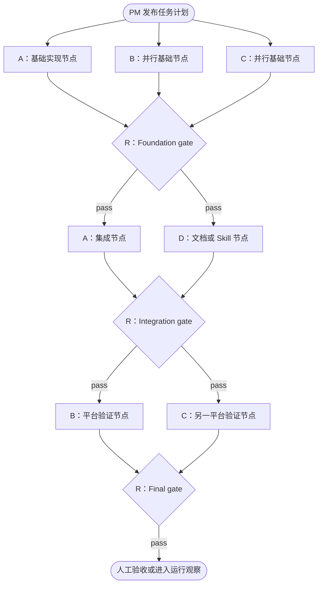

# 任务计划书

## 0 执行状态

> 每个执行阶段结束后更新一次。本节只记录已实际发生的运行结果，不在调研或计划阶段预填。

状态：`<待真实运行后填写>`

执行日期：`<YYYY-MM-DD>`

实际变更：`<运行时实际变更的文件、配置或流程>`

执行证据：`<任务、日志、命令、artifact 或截图路径>`

最终结论：`<pass | needs_fix | block>`

## 1 调研报告

### 1.1 背景和需求

> 按“业务场景—当前现状—核心问题”的顺序说明需求，并明确本次边界。

`<说明业务场景、现有痛点和本次需要解决的边界。>`

### 1.2 初级方案

> 只列出需要完成的任务点和目标，不在本节安排执行顺序、执行人或具体实现步骤。

- `<方案一：目标与核心做法。>`
- `<方案二：目标与核心做法。>`
- `<方案三：目标与核心做法。>`

### 1.3 改动范围

`<列出预计涉及的系统、目录、文件、配置和接口；同时明确不在本次范围内的事项。>`

### 1.4 验收标准

1. `<可观察、可验证的标准一。>`
2. `<可观察、可验证的标准二。>`
3. `<可观察、可验证的标准三。>`
4. `<可观察、可验证的标准四。>`

## 2 任务计划

> 由 PM 在调研结论明确后编写。具体执行人只使用 A、B、C、D、R；流程图中的每个工作节点默认对应一个可独立 claim、验收和 complete 的 scheduler task。
角色职责：
>  - **P（PM）**：负责目标澄清、优先级、依赖关系、容量、任务发布和 gate 决策；不领取或执行任务。
>  - **R（Researcher）**：默认承担只读调研、风险分析、代码或结果审查及 gate review；产出报告和决策建议，不实施修复或发布执行任务，除非被明确重新授权。
>  - **A（执行窗口）**：承担已领取任务范围内的实现、排障和验证；默认适合复杂实现、跨文件改动或难复现问题。
>  - **B（执行窗口）**：承担已领取任务范围内的实现、整理和常规验证；默认适合边界清楚、成本较低的执行工作。
>  - **C（执行窗口）**：承担已领取任务范围内的实现、审查辅助或验证；具体工作以 task 的 conflict domain 和依赖为准。
>  - **D（执行窗口）**：承担已领取任务范围内的实现、审查辅助、文档整理或验证；具体工作以 task 的 conflict domain 和依赖为准。
> A-D 只能修改已领取任务授予的文件，并遵守任务中的依赖、冲突域和 `must_not_touch` 边界。角色分工不替代 task 的 `worker_prompt`；后者才是单项工作的最终依据。
>
> A/B/C/D 的普通实现或文档任务默认不写 `REPORT.md`，完成结果、验证命令、修改文件、风险和下一步写入 scheduler 的 `complete --summary`。只有 R gate、调研、复杂审计或明确要求长期留档的多工件交付才创建报告或决策文件。

### 2.1 总线流程图

> 总线图用于让 P 快速看清任务量、并行关系、阶段 gate 和关键路径。只画实际任务、主并行线、汇合点和 gate；不要把默认 `needs_fix` 返工线、same-task continuation、轮询、等待、旧系统持续运行等固定规则重复画进图中，这些统一写在图下说明。
>
> 同一角色连续修改同一文件域、且中间没有 gate、平台切换或外部等待时，应合并成一个任务。跨 gate、跨平台验证、授权边界变化或产出可独立验收时，应拆成新任务。任务完成后立即释放 lease；等待 gate 时不保持实现任务 `running`，也不靠 heartbeat 长期占用窗口。
>
> 批次只统计由 P 发布的一组执行任务。R 的 Contract/Foundation/Integration/Final gate 是批次完成条件和批次间解锁节点，不单独编号为一个批次；gate 可以在流程图中画成决策节点，并写在对应批次的“完成条件”或批次末尾的 gate 小节中。

总线含义：`<用 3-5 句话说明首批节点、并行关系、各 gate 等待哪些证据、通过后发布哪些后续节点。明确哪些相邻工作已合并、哪些因跨 gate 或平台边界拆分。未完成节点返工使用 continuation；已 complete 节点出现新缺口时发布短修复任务。默认返工线不画入总线图。>`

任务拆分规则：

- 一个流程节点应有明确输入、文件边界、产出和验收条件，并尽量在一个正常窗口周期内完成。
- 批次表示一组可执行任务；审批、审查结论和 gate 不单独组成批次。
- 同角色连续两个节点若无 gate/等待、文件域一致且可一次验收，应合并。
- 跨 gate、跨平台、跨 conflict domain、writable surface 变化或需等待外部证据时必须拆分。
- gate 通过后再解锁后续任务；不要提前 claim 后靠 heartbeat 等待。
- 旧窗口关闭前必须 complete、block 或显式 handoff；不得遗留有效 `running` lease。

### 2.2 节点批次一：`<批次名称>`

| Task ID | 执行人 | 任务概况 | 依赖 | 并行关系 | 完成条件 |
| --- | --- | --- | --- | --- | --- |
| `<task_id>` | `<A/B/C/D/R>` | `<任务目标、输入、文件边界和产出>` | `<无或上游 task_id>` | `<可与哪些节点并行>` | `<独立验收条件>` |

#### 2.2.1 `<任务名称>`

执行方案：`<由 PM 补充。>`

产出：`<由 PM 补充。>`

### 2.3 节点批次二：`<批次名称>`

| Task ID | 执行人 | 任务概况 | 依赖 | 并行关系 | 完成条件 |
| --- | --- | --- | --- | --- | --- |
| `<task_id>` | `<A/B/C/D/R>` | `<任务目标、输入、文件边界和产出>` | `<上游 task_id 或 gate>` | `<可与哪些节点并行>` | `<独立验收条件>` |

#### 2.3.1 `<任务名称>`

执行方案：`<由 PM 补充。>`

产出：`<由 PM 补充。>`

> 如存在更多执行批次，继续使用 `2.4 节点批次三`、`2.5 节点批次四`……依次顺延。一个 gate 解锁的并行任务组对应一个批次，不得把多个先后依赖批次压进同一节；gate 本身放在前一批次完成条件或批次末尾的小节，不新增批次编号。

### 2.N 最终审查验收

> 写明人工验收的对象、步骤和通过条件。人工验收通过后，任务计划即结束；未通过时记录问题并进入后续处置。

验收人：`<人工验收人或验收角色>`

验收对象：`<需要人工核验的功能、页面、配置、文档或运行结果>`

验收步骤：

1. `<人工操作步骤一。>`
2. `<人工操作步骤二。>`
3. `<人工操作步骤三。>`

通过条件：`<所有必须条件满足后，任务计划结束。>`

不通过处理：`<未完成节点由原任务 continuation；已完成节点出现新缺口、跨平台或授权边界变化时，由 PM 发布短修复任务。>`

### 2.(N+1) 推荐执行顺序总览

1. `<先发布哪些无依赖节点，以及它们如何并行。>`
2. `<首个 gate 通过后，解锁并行发布哪些节点。>`
3. `<后续 gate、平台验证和最终审查的发布顺序。>`
4. `<每个节点完成即 complete；不要在 gate 等待期间保持 running。>`
